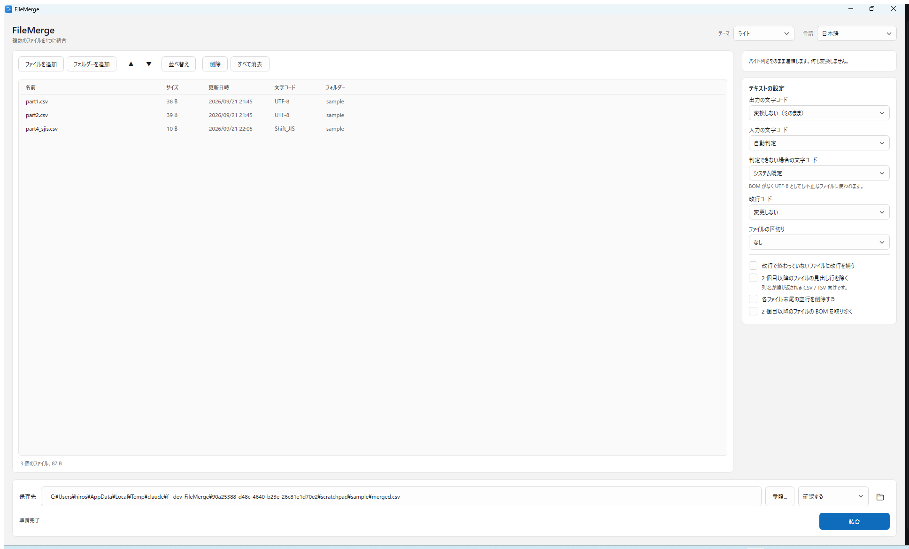

# てくてくファイル結合

複数のファイルを1つに結合する Windows アプリです。EXE 1個だけ。インストール不要、.NET のインストールも不要、レジストリも常駐も使いません。

[English README](README.md)



## 最初に知っておいてほしいこと

**FileMerge は既定では、ファイルの中身を一切変更しません。**

すべて初期設定のまま実行すると、出力は入力ファイルを**バイト単位でそのまま連結**したものになります（`copy /b a+b out` と同じ結果です）。テキストでも CSV でもログでも、分割ファイルの `.001` / `.002` でも同じです。

これが重要なのは、勝手に変換する方が危険だからです。文字コードを自動変換するツールは、各ファイルの文字コードを**推測**する必要があります。そして文字コード判定はヒューリスティックなので、外れることがあります。外れたとき、そのツールはテキストを誤った内容に書き換えてしまい、元のバイト列はもう残っていません。FileMerge はファイルを文字として読むことがないので、このリスクを一切取りません。

オプションは2つだけで、どちらも既定は OFF、どちらもファイルの端にしか触れません。

| 設定 | 既定値 | 動作 |
| --- | --- | --- |
| 改行で終わっていないファイルに CRLF を補う | **OFF** | 2つのファイルが同じ行に繋がるのを防ぐ |
| 2 個目以降のファイルの BOM を取り除く | **OFF** | BOM が本文の途中に残るのを防ぐ |

どちらも文字としての読み込みはしません。前者はファイルの最後の1文字だけを見て CR と LF の2バイト（UTF-16 なら2バイト単位）を書き足し、後者はファイル先頭の数バイトを飛ばすだけです。文字コードの変換は一切ありません。

**警告バナーの類は一切出しません。** 文字コードが違うファイルを結合すれば文字化けしますし、2個目以降の BOM は本文の途中に残りますし、改行で終わっていないファイルは次のファイルと同じ行に繋がります。これらはすべて「何も変換しない」ことの正しい結果です。画面が表示するのは、各ファイルの判定された文字コードだけです（一覧の「文字コード」列に、単なる情報として）。

## 機能

- **ドラッグ＆ドロップ**、**ファイルを追加**、**フォルダーを追加**（`*.log; *.txt` のようなワイルドカード指定、サブフォルダー再帰、該当件数のリアルタイム表示）
- **行をドラッグして並べ替え**。上下ボタン、名前順・日時順・サイズ順・パス順のソートも可能
- **自然順ソート**。`part2` が `part10` より前、`.001` が `.010` より前になります。通常のアルファベット順は分割ファイルを静かに壊すため、これを既定にしています
- **分割ファイルの復元**（`.001` `.part01` `.r00` `.z01`）をバイト単位で正確に
- 結合前に**各ファイルの文字コードを判定して表示**
- 大きなファイルでも**進捗表示とキャンセル**が可能。いったん一時ファイルに書くため、中断・失敗しても中途半端なファイルが残りません
- **入力ファイル自身への上書きを拒否**します
- **ライト / ダークテーマ**（Windows 連動または固定）
- **21言語対応**。実行中に切り替え可能。アラビア語では右から左のレイアウトになります

## ダウンロード

[Releases](../../releases) から取得してください。

| ファイル | サイズ | 必要なもの |
| --- | --- | --- |
| `FileMerge-<version>-setup-x64.exe` | 約 43 MB | なし（普通のインストーラー。スタートメニューに登録され、「設定」からアンインストールできます） |
| `FileMerge-<version>-win-x64.zip` | 約 54 MB | なし（中身は .NET を同梱した EXE 1つ。展開してダブルクリック） |
| `FileMerge-<version>-win-arm64.zip` | 約 50 MB | なし（ARM 版 Windows 用） |
| `FileMerge-<version>-win-x64-netdep.zip` | 約 0.6 MB | [.NET Desktop Runtime 10](https://dotnet.microsoft.com/download/dotnet/10.0) |

Windows 10 バージョン 1809 以降。ダブルクリックで起動します。

単一EXE版は初回起動時のみ、WPF のネイティブコンポーネントを `%TEMP%` に展開します。これは単一EXE形式の WPF の仕様で、管理者権限は不要、展開は1回だけです。

インストーラーも、インストール先の PC に何も要求しません（.NET も Inno Setup も不要）。管理者権限なしで今のユーザーにインストールされ（最初の画面で全ユーザー向けに Program Files へ入れることも選べます）、スタートメニューに登録され、「設定」→「アプリ」からアンインストールできます。まだコード署名をしていないため、初回実行時に Windows SmartScreen の警告が出ることがあります。

自動更新のある **[Microsoft Store 版](https://apps.microsoft.com/detail/9MSSHDP4MJZK)** もあります。

### ポータブルモード

設定は通常 `%LOCALAPPDATA%\FileMerge\` に保存されます。EXE と同じ場所に `portable.txt` という空ファイルを置くと、設定が EXE の隣に保存されるようになり、USB メモリーに入れて持ち運べます。書き込み不可のメディアでは設定が保存されないだけで、アプリは通常どおり動きます。

## 対応言語

English · 日本語 · 简体中文 · 繁體中文 · 한국어 · Español · Português (Brasil) · Français ·
Deutsch · Italiano · Русский · Українська · Polski · Nederlands · Svenska · Türkçe · العربية · हिन्दी ·
Bahasa Indonesia · Tiếng Việt · ไทย

初回起動時に Windows の言語から自動選択され、画面上部でいつでも変更できます。文字列はすべて [`src/FileMerge/Localization/Strings`](src/FileMerge/Localization/Strings) に言語ごとの JSON ファイルとして置かれ、EXE に埋め込まれます（ポータブル版を単一ファイルに保つため）。`en.json` にあるキーが欠けている言語があると CI が失敗します。

## ソースからビルド

[.NET 10 SDK](https://dotnet.microsoft.com/download/dotnet/10.0) が必要です。

```powershell
git clone https://github.com/hiro5791/FileMerge.git
cd FileMerge

dotnet test tests/FileMerge.Tests/FileMerge.Tests.csproj   # 44 件
dotnet run --project src/FileMerge/FileMerge.csproj

./build/Build-Portable.ps1                                  # artifacts/*.exe
```

| プロジェクト | 内容 |
| --- | --- |
| `src/FileMerge.Core` | 結合エンジン、文字コード判定、フォルダー走査。UI に依存しません |
| `src/FileMerge` | WPF の画面、ビューモデル、テーマ、21言語の文字列 |
| `tests/FileMerge.Tests` | xUnit テスト。大半は「バイト列が変化しないこと」の検証です |

アイコンの元画像は [`artwork/`](artwork) にあります。`icon.png` は 32px 以上用、`icon-small.png` は 16px・24px 用の簡略版です。どちらかを差し替えたら `./build/New-Icons.ps1` を実行すると、.ico とストア用タイルが作り直されます。

## Microsoft Store

```powershell
./packaging/msix/Build-Msix.ps1 `
    -IdentityName '12345Publisher.FileMerge' `
    -Publisher 'CN=ABCDEFGH-1234-5678-9012-ABCDEFGHIJKL' `
    -PublisherDisplayName 'Your Publisher Name'
```

この3つの値は、Partner Center で予約したアプリ名の **製品 ID（Product identity）** に表示されるものです。パッケージは意図的に未署名のままにします。ストア提出物には Partner Center 側が署名するためです。提出手順の全体は [docs/STORE.md](docs/STORE.md) を参照してください。

## 寄付

てくてくファイル結合は無料で、これからも無料です。役に立ったらお礼の気持ちとして寄付していただけるとうれしいです。寄付は任意で、寄付によって使える機能が増えることはありません。

- [Ko-fi](https://ko-fi.com/hiro5791)（1回だけ・毎月。アプリの「♥ 寄付」ボタンからも開けます）
- [GitHub Sponsors](https://github.com/sponsors/hiro5791)

## ライセンス

[MIT](LICENSE)
