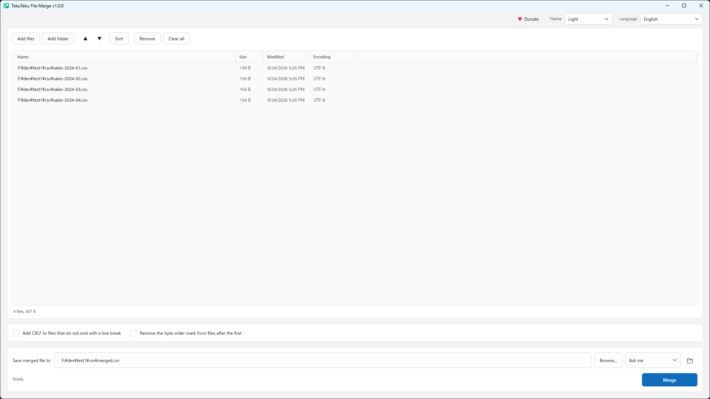

# TekuTeku File Merge

Combine multiple files into one, on Windows. A single `.exe` — nothing to install, no .NET
runtime needed, no registry entries, no background service.

[日本語 README](README.ja.md)



## The one thing worth knowing

**By default FileMerge does not change your files. At all.**

Run it with everything at its defaults and the output is the input files joined byte for byte
— the same result as `copy /b a+b out`. That holds for text, for CSV, for logs, and for the
`.001` / `.002` parts of a split archive.

This matters because the alternative is worse. A merge tool that "helpfully" converts
character encodings has to *guess* what encoding each file is in, and encoding detection is a
heuristic that is sometimes wrong. When it guesses wrong it rewrites your text incorrectly and
the original bytes are gone. FileMerge never reads a file as text, so it never takes that risk.

There are two options, both off by default, and both touch only the edges of a file:

| Option | Default | What it does |
| --- | --- | --- |
| Add CRLF to files that do not end with a line break | **Off** | Stops two files running onto the same line |
| Remove the byte order mark from files after the first | **Off** | Stops a stray BOM landing mid-text |

Neither decodes anything. The first looks only at a file's last character and writes the two
bytes CR and LF (as 2-byte units for UTF-16); the second leaves out the first few bytes of a
file. There is no encoding conversion at all.

There are no warning banners. Joining files that do not share an encoding produces garbled
text, a BOM from a later file stays in the middle of the output, and a file that does not end
with a line break runs into the next one — all of which is the faithful result of not
converting anything. What the window does show is each file's detected encoding, in the list,
as plain information.

## Features

- **Drag and drop**, or **Add files**, or **Add folder** with a wildcard filter
  (`*.log; *.txt`), subfolder recursion, and a live count of what matches
- **Reorder by dragging rows**, or with the arrow buttons, or sort by name, date, size or path
- **Natural sort**, so `part2` comes before `part10` and `.001` before `.010` — ordinary
  alphabetical sorting silently corrupts split archives, so this is the default everywhere
- **Rejoins split archives** (`.001`, `.part01`, `.r00`, `.z01`) byte-exactly
- **Detects and shows each file's encoding** before you merge anything
- **Progress and cancel** for large merges, written to a temporary file first so a cancelled
  or failed run never leaves a half-written file where you expect a complete one
- **Refuses to write over one of its own inputs**
- **Light / dark theme**, following Windows or pinned
- **21 languages**, switchable at runtime, with right-to-left layout for Arabic

## Download

Grab the latest from [Releases](../../releases):

| File | Size | Requirements |
| --- | --- | --- |
| `FileMerge-<version>-setup-x64.exe` | ~43 MB | none — an ordinary installer: Start menu entry, uninstall from Settings |
| `FileMerge-<version>-win-x64.exe` | ~59 MB | none — .NET is inside the executable |
| `FileMerge-<version>-win-arm64.exe` | ~59 MB | none |
| `FileMerge-<version>-win-x64-netdep.zip` | ~0.3 MB | [.NET Desktop Runtime 10](https://dotnet.microsoft.com/download/dotnet/10.0) |

Windows 10 version 1809 or later. Double-click and it runs.

On first launch the single-file build unpacks its native WPF components into `%TEMP%`. That is
how single-file WPF works; it needs no administrator rights and happens only once.

The installer needs nothing on the target machine either — no .NET and no Inno Setup. It
installs for the current user without administrator rights (an all-users install into
Program Files is offered on the first page), adds a Start menu entry, and can be removed from
Settings → Apps. It is not code-signed yet, so Windows SmartScreen may warn the first time it
is run.

FileMerge is also on the **Microsoft Store**, if you would rather have automatic updates.

### Portable mode

Settings normally live in `%LOCALAPPDATA%\FileMerge\`. Put an empty file named `portable.txt`
next to the executable and they are stored beside it instead, so a copy on a USB stick carries
its own configuration. On read-only media nothing is written and the app still runs.

## Languages

English · 日本語 · 简体中文 · 繁體中文 · 한국어 · Español · Português (Brasil) · Français ·
Deutsch · Italiano · Русский · Українська · Polski · Nederlands · Svenska · Türkçe · العربية · हिन्दी ·
Bahasa Indonesia · Tiếng Việt · ไทย

The language is picked from Windows on first run and can be changed at any time from the
header. Every string lives in [`src/FileMerge/Localization/Strings`](src/FileMerge/Localization/Strings)
as one JSON file per language, embedded into the executable so the portable build stays a
single file. CI fails if any language is missing a key that `en.json` has.

## Build from source

Requires the [.NET 10 SDK](https://dotnet.microsoft.com/download/dotnet/10.0).

```powershell
git clone https://github.com/hiro5791/FileMerge.git
cd FileMerge

dotnet test tests/FileMerge.Tests/FileMerge.Tests.csproj   # 44 tests
dotnet run --project src/FileMerge/FileMerge.csproj

./build/Build-Portable.ps1                                  # artifacts/*.exe
```

| Project | Contents |
| --- | --- |
| `src/FileMerge.Core` | Merge engine, encoding detection, folder scanning. No UI dependency. |
| `src/FileMerge` | WPF window, view models, themes, the 21 string tables. |
| `tests/FileMerge.Tests` | xUnit tests, most of them asserting that bytes survive unchanged. |

The icon artwork lives in [`artwork/`](artwork): `icon.png` for 32 px and up, and a simplified
`icon-small.png` for 16 and 24 px. After replacing either, run `./build/New-Icons.ps1` to
regenerate the `.ico` and the Store tiles.

## Microsoft Store

```powershell
./packaging/msix/Build-Msix.ps1 `
    -IdentityName '12345Publisher.FileMerge' `
    -Publisher 'CN=ABCDEFGH-1234-5678-9012-ABCDEFGHIJKL' `
    -PublisherDisplayName 'Your Publisher Name'
```

Those three values come from Partner Center, under **Product identity** for your reserved app
name. The package is left unsigned on purpose: Partner Center signs Store submissions itself.
See [docs/STORE.md](docs/STORE.md) for the full submission checklist.

## Support

TekuTeku File Merge is free and stays free. If it saves you time and you would like to say
thanks, you can leave a tip. It is entirely optional and unlocks nothing.

- [Ko-fi](https://ko-fi.com/hiro5791) (one-time or monthly; the ♥ Donate button in the app opens this page)
- [GitHub Sponsors](https://github.com/sponsors/hiro5791)

## License

[MIT](LICENSE)
